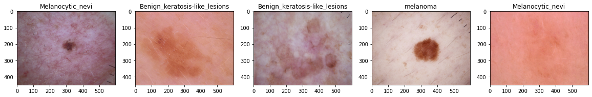
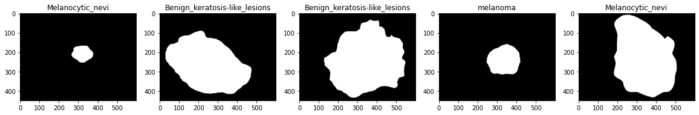

# Skin Lesion Classification and Recognition

# Data

 - The data used in the project is publicly available by Harvard, found here: [Large Collection of Multi-source Dermatoscopic Images of Common Pigmented Skin Lesions](https://dataverse.harvard.edu/dataset.xhtml?persistentId=doi:10.7910/DVN/DBW86T).
  - The data contains:
    1. The 3-channel colour images of skin lesions.
    2. Their corresponding segmentation masks.
    3. The metadata of the patients containing:
        - Patient ids
        - Gender
        - Age
        - Type of lesion
        - Area of lesion (scalp, ear etc).
 
 - The sample from the data can be seen here. The title of the images are the type of lesion, provided in the metadata file.
    
    
 - The corresponding ground truth segmented masks are as follows.
    

# Objective

 - The Objective of the project is not just to segmented the lesion, but also to identify the type of lesion at the same time.
 -  Hence, the lesion needs to be recognized, and also classified by the same model.

 # Current Progress
 - Exploratory data analysis (EDA) is being performed.
 - The AI model for recognition and classification being developed.
 - The proposed model:
    - Encoder-Decoder structure architecture based on convolutional neural networ
    - Simultaneuosly getting a softmax output for the classification of the type of lesion.